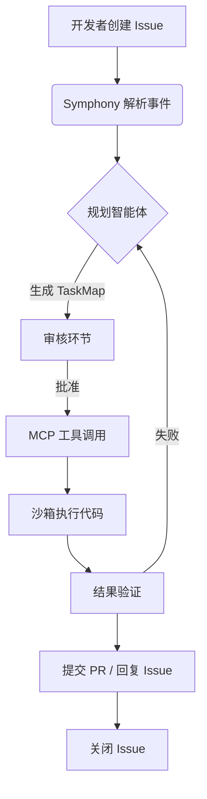

# OpenAI Symphony 洞察报告：将 Issue 系统转化为持续运行的智能体

## 概述与背景

近期，OpenAI 开源了一套名为 **Symphony** 的编排规范及相关代码库。其核心愿景并非创造又一个 AI 编码助手，而是**将传统的任务追踪系统（如 GitHub Issues, Linear）重新定义为智能体（Agent）的运行时环境** [OpenAI 官方博客](https://openai.com/index/open-source-codex-orche)。

在过去的软件开发流程中，Issue 系统通常充当“备忘录”的角色：人类提出需求，人类指派任务，人类关闭 Issue。Symphony 打破了这一范式，提出了一套名为 **“Codex Orchestration”** 的规范。它使得一个 LLM 驱动的智能体可以持续地监听 Issue 事件，将一次性的任务创建动作，转变为由智能体主导的“规划-执行-反馈”闭环流程。

这种转变意味着，开发者不再只是给其他开发者指派 Bug，而是可以直接给 AI 指派一个模糊的探索性任务。Symphony 充当了人类模糊意图与确定性机器执行之间的桥梁。

### 核心发现

1.  **状态驱动而非对话驱动**：Symphony 不是基于 WebSocket 的实时对话机器人。它利用 Issue 的评论、状态标签和元数据作为 **唯一的状态来源**。这意味着智能体的“思考过程”被永久记录在案，具有天然的可审计性。
2.  **MCP 的枢纽化应用**：Symphony 深度集成了 **模型上下文协议（Model Context Protocol, MCP）**。它不仅把 MCP 当作工具调用接口，更是将其作为智能体感知外部世界（如读取文件系统、查询数据库）的感官系统，让 Issue 中的文本指令能直接映射到 MCP 的标准化 API 上 [OpenAI 官方博客](https://openai.com/index/open-source-codex-orche)。
3.  **“计划先行”的沙箱执行**：智能体在接收到复杂指令后，必须先生成一份符合 `Task` 架构的执行计划（Plan），并在隔离的沙箱环境中执行代码验证，最后才将生成的 PR 或结果提交回主干。这显著提高了生成代码的可信度。

---

## 技术分析

### 1. 架构解构：从静态 Issue 到动态智能体

Symphony 定义了一套严格的状态机转换协议，其架构主要由以下三层组成：

*   **触发器层**：监听 Webhook，将 Issue 创建、评论等事件转化为标准的 `OrchestratorRequest`。
*   **编排层**：核心逻辑。它解析指令，生成 `TaskMap`（包含子任务依赖图），并通过 MCP 客户端调用外部工具。
*   **执行层**：包含 `bash` 和 `python` 的沙箱执行器，用于运行生成的脚本并捕获输出。

**关键技术特征**：
*   **HITL 机制**：Symphony 内置了审批门控。凡涉及写入外部系统（如数据库变更、代码合入）的操作，必须通过 Issue 回复中的特定签名或 CI 状态检查确认。
*   **工作空间缓存**：智能体执行过程中产生的中间文件（如数据库迁移脚本）并非每次都重新生成，而是通过 `volume` 挂载复用，大幅降低了 Token 消耗。

### 2. 对比分析：Symphony 与传统开发自动化的分野

为了客观评估 Symphony 的实际价值，我们将其与现有的几种主流自动化方案进行横向对比：

| 维度 | OpenAI Symphony | 传统 CI/CD / Bot | 自主智能体框架（如 AutoGPT） | 多轮对话 Chatbot |
| :--- | :--- | :--- | :--- | :--- |
| **交互界面** | 自然语言 Issue | YAML 配置 / 命令行 | 自然语言 / 特定 UI | 自然语言对话框 |
| **生命周期** | **长周期持久化** | 一次性、瞬态运行 | 无状态或本地文件持久 | 会话级持久 |
| **可审计性** | **极强**（基于 Git + Issue 记录） | 中等（构建日志） | 较弱（需额外日志系统） | 极弱（依赖截图） |
| **工具生态** | MCP 标准化协议 | 插件体系 / SDK | 异构工具集 | 封闭生态 |
| **执行环境** | 服务器端沙箱 | 容器化 Runner | 本地 Python 进程 | 云端黑盒 |

**客观优劣评估**：
*   **Symphony 的优势**：它在团队协作上达成了天然的对齐。因为产物直接就是 PR 或 Issue 回复，开发者无需改变现有 GitHub 工作流即可审查 AI 代码。其利用 MCP 解决了 AI 工具调用的“碎片化”问题，实现了工具的可插拔。
*   **Symphony 的局限**：对于实时性要求极高的交互（例如“立刻帮我改一行代码然后热更新”），Issue 系统的轮询和响应延迟是最大的瓶颈。它更倾向于**异步的、探索性的或跨系统的编排任务**，而非低延迟编码辅助。

### 3. 当前规范的技术局限性
尽管设计优雅，Symphony 仍处于早期阶段：
*   **状态机僵化风险**：其定义的 `p-state` 文件格式虽然规范了状态，但在高度动态的任务（如需要根据实时 A/B 测试反馈调整策略）中，过于严格的状态定义可能导致智能体“死锁”。
*   **多智能体冲突**：当一个 Issue 下同时存在多个 Symphony 实例或人类频繁高频评论时，规范目前缺乏高级的“锁机制”或“版本控制”来处理冲突合并。

---

## 可行动建议

基于上述技术分析，针对不同角色的研发团队，提出以下落地方案：

### 1. 针对开源项目维护者：从“PR Review”转向“任务验收”
建议将重复性的“配置更新”或“依赖升级”完全移交。
*   **执行路径**：立即建立标准的 `symphony.yaml` 模板，将仓库的 CI 管控规则转化为 MCP 工具。
*   **风险控制**：开启强制性的人类审批签名。在未经验证之前，禁止智能体自动合入代码。利用 Symphony 的沙箱天然隔绝其访问生产密钥。

### 2. 针对平台工程团队：构建内部的 MCP 中间层
Symphony 的核心价值依赖于 MCP 服务的丰富度。如果只是调用 GitHub API，其智能极其有限。
*   **深度集成**：需要将内部 CMDB、监控系统、发布系统全部封装为 MCP 标准接口。
*   **实施案例**：创建一个“全链路监控”专用 Issue 模板，当发出“账号服务响应变慢”的 Issue 时，Symphony 不仅能查日志，还能根据 MCP 获取的指标自动生成火焰图分析报告并回复在 Issue 下。

### 3. 针对 NewSQL/基础设施团队：自动化攻坚
利用其长周期执行特性处理疑难杂症。
*   **具体场景**：数据库 DDL 变更的风险评估。
*   **执行路径**：开发者在 Issue 中贴上 `ALTER TABLE...` 语句。Symphony 读取 Schema 元数据，在沙箱中构建影子表，回放全量 SQL 审计日志，生成锁等待风险评估报告，最后将报告和优化建议一同提交。

### 4. 风险提示
在未进行适当的人机交互工程学调整前，不要直接将 Symphony 接入面向全体用户的公共 Issue 渠道。需严防“提示词注入”攻击，恶意用户在 Issue 描述中插入指令试图绕过 `TaskMap` 限制，必须在编排层对用户输入与系统指令进行严格分割。

---

## 来源与参考
1. [OpenAI 官方开源博客：Open-source Codex Orchestration with Symphony](https://openai.com/index/open-source-codex-orche)
2. [模型上下文协议（MCP）官方规范](https://modelcontextprotocol.io/)